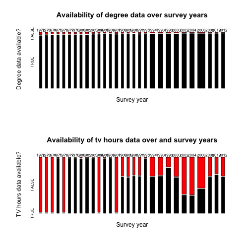
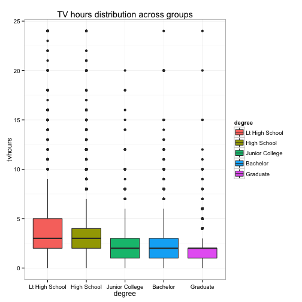
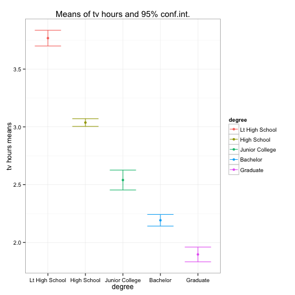

<!-- For more info on RMarkdown see http://rmarkdown.rstudio.com/ -->

<!-- Enter the code required to load your data in the space below. The data will be loaded but the line of code won't show up in your write up (echo=FALSE) in order to save space-->


<!-- In the remainder of the document, add R code chunks as needed -->

### Introduction

Research question aims at investigating wether a relationship exists between the highest school degree a person has achieved and the average number of tv hours per day he usually watches? I think answer to this is relevant for the advertising industry, since it can generate insights on the actual targeting capabilities of tv advertising according to people education levels.


### Data

- Data collection: data covers answers to surveys independently drawn sample of English-speaking 
persons 18 years of age or over, living in non-institutional arrangements within the United States. Data have been gathered over the period 1972-2012. Starting in 2006 Spanish-speakers were added to the target population.

- Cases: each case corresponds to the answers an individual gave to the survey in a specific year in which the survey has been taken. **Number of cases is 57061**.

- Variables: the project will focus on analysis of variable **degree** categorical, ordinal variable with 5 categories; and variable **tvhours** numerical, discrete variable

- Study: study is based on a-posteriori observations on data gathered from a random sample. It is therefore an **observational study**.

- Generalizability: population of interest is english-speaking persons 18 years of age or over, living in non-institutional arrangements within the United States. Answers relate to independently drawn sample from the population of interest and therefore **can be generalized**.

- Causality: since this is an observational study, **no causality** relationship can be established

- Sources of bias: data can suffer from non-response and voluntary bias. Non-response should especially be a concern since considering the fact that not all respondents answered all questions in all years.

### Exploratory data analysis
#### Impact of missing data 

Looking at the selected variable, it's clear that for some years, percentage of tv hours missing is extremely relevant.

 

For the sake of the project I will **discard all the records containgin NA's** both on degree variable OR tv hours variable. However this should be a **not negligible source of non-response bias** that should be take in to account. In discarding NA's records I will **get rid of 23770 records, 41.6% of the data**.

```r
library(dplyr)
gss <- tbl_df(gss) %>% select(degree, tvhours) %>% filter(!is.na(degree) & !is.na(tvhours))
```


#### Visualization of data

Following figure illustrates the relationship among the two variables. **TV hours** distrbution are **right skewed** among all groups, moreover variability across groups is quite different.


```r
library(ggplot2)
par(mfrow = c(1, 1))
qplot(data = gss, degree, tvhours, geom = "boxplot", fill = degree, main = "TV hours distribution across groups") + 
    theme_bw()
```

 


Just looking at the boxplots it looks like **the higher the degree, the lesser the tv hours watched**.

#### Descriptive statistics

In this first step I will look at **means** across different groups **as standalone statistics**, comparison of means will be conducted in next paragraph. Let's therefore check conditions for CLT for the means across groups:

- Independence: ok since the sampled observations are independent and sample size are less than 10% of the population.
- Sample/size and skew: ok since we have skewed distrbutions of tv hours, but sizes of samples are much larger than 30 for all groups.

We can therefore apply CLT for the mean of 5 groups and calculate 95% confidence interval for the tv hours means across groups:


```r
gss <- group_by(gss, degree)
z <- -qnorm(0.025, lower.tail = T)
summary <- summarise(gss, num = n(), tvh_mean = mean(tvhours), tvh_sd = sd(tvhours), 
    lower_ci = mean(tvhours) - z * (sd(tvhours)/sqrt(n())), upper_ci = mean(tvhours) + 
        z * (sd(tvhours)/sqrt(n())))
summary
```

```
## Source: local data frame [5 x 6]
## 
##           degree   num tvh_mean tvh_sd lower_ci upper_ci
## 1 Lt High School  6807    3.768  2.868    3.700    3.836
## 2    High School 17534    3.037  2.255    3.004    3.071
## 3 Junior College  1881    2.540  1.907    2.454    2.626
## 4       Bachelor  4771    2.192  1.770    2.142    2.242
## 5       Graduate  2298    1.896  1.559    1.833    1.960
```


Looking at the **confidence inetrvals** for the means we see that they are well separated across groups and **do not overlap**, so it's very likely that I will found evidence of differences when comparing the means.


```r
limits <- aes(ymax = summary$upper_ci, ymin = summary$lower_ci)
qplot(data = summary, degree, tvh_mean, col = degree, main = "Means of tv hours and 95% conf.int.", 
    ylab = "tv hours means") + geom_errorbar(limits, width = 0.7) + theme_bw()
```

 


### Inference

#### Hypotheses: I will compare means among 5 groups of people depending on education level. Therefore:

- H0: The mean of tv hours watched per day is the same across all groups: mu1 = mu2 = mu3 = mu4 = mu5
- HA: at least one pair of means are different from each other

#### Method used and conditions

I will use **ANOVA** method to assess wether at least one mean is different from the others. Conditions for ANOVA are:

- **Indipendence**: sampled observations are independent and groups are independent of each other as well.
- **Approximately normal**: this condition is not satisfied looking at the distrbution of response variable, however sample size are large enough to pass this condition.
- **Constant variance**: we have seen from previous paragaph that variability is quite different across groups. Moreover sample sizes are different for various groups. This could affect the goodness of final conclusion.

#### Inference


```r
anova_table <- anova(lm(data = gss, tvhours ~ degree))
anova_table
```

```
## Analysis of Variance Table
## 
## Response: tvhours
##              Df Sum Sq Mean Sq F value Pr(>F)    
## degree        4  10295    2574     497 <2e-16 ***
## Residuals 33286 172537       5                   
## ---
## Signif. codes:  0 '***' 0.001 '**' 0.01 '*' 0.05 '.' 0.1 ' ' 1
```


#### Interpretation of results

ANOVA p-value is small so (as expected) we **reject the null hypothesis** and we can state that we found evidence that at least one mean is different from the others. 

#### Comparison fo two closest means

I will compare **only 2 of the 5 means** for the different groups. In particular I will compare the two closest means. As i t can be seen from the descriptive statistics parapgraph, means for Bachelor and Graduate groups, are the closest one, therefore I will focus only on this difference. This is **not an exhaustive and complete comparison** of means, but **for the sake of brevity** I will make all the possible comparisons and I will focus on these two. I will keep alpha level at 5% significance level and apply **Bonferroni correction**:


```r
mean_bach <- summary$tvh_mean[summary$degree == "Bachelor"]
n_bach <- summary$num[summary$degree == "Bachelor"]
mean_grad <- summary$tvh_mean[summary$degree == "Graduate"]
n_grad <- summary$num[summary$degree == "Graduate"]
MSE <- anova_table$`Mean Sq`[2]
df <- anova_table$Df[2]
corrected_alpha <- 0.05/(5 * (5 - 1)/2)
t <- (mean_bach - mean_grad)/sqrt((MSE/n_bach) + (MSE/n_grad))
p_value_diff <- 2 * pt(t, df = df, lower.tail = F)
p_value_diff
```

```
## [1] 3.196e-07
```


Th p-value is very small so we can reject the null hyptothesis that the 2 means are equal and conclude that we found evidence that the means are different.

### Conclusion

To wrap up the analysis:

1 - I analyzed relationship among **daily average watched tv hours** and **highest degree achieved**.

2 - Data come from the gss survey and are **generalizable to the population** of interest.

3 - **However** it must be considered that **data** about tv hours watched are **missing for some years**.

4 - I calculated means for the the 5 groups and found that the higher the degree achieved, the less the tv hours watched.

5 - I then the ANOVA table and found that at least one mean is different from the other. However, data suffers from quite different **variability across groups** and ANOVA results might be affected by this proble.

6 - I then compared means for **Bachelor and Graduate** groups and found that their **difference in mean is statistically significant**.

### References

Smith, Tom W., Michael Hout, and Peter V. Marsden. General Social Survey, 1972-2012 [Cumulative File]. ICPSR34802-v1. Storrs, CT: Roper Center for Public Opinion Research, University of Connecticut /Ann Arbor, MI: Inter-university Consortium for Political and Social Research [distributors], 2013-09-11.

Persistent URL: <a href= "http://doi.org/10.3886/ICPSR34802.v1">http://doi.org/10.3886/ICPSR34802.v1</a>

### Appendix


```
## Source: local data frame [50 x 2]
## Groups: degree
## 
##            degree tvhours
## 1     High School       1
## 2     High School       2
## 3     High School       2
## 4        Graduate       1
## 5        Graduate       3
## 6  Lt High School       4
## 7  Lt High School       4
## 8  Lt High School       2
## 9        Graduate       1
## 10       Bachelor       3
## 11 Lt High School       3
## 12 Lt High School       3
## 13       Bachelor       3
## 14       Bachelor       3
## 15 Lt High School       5
## 16    High School       2
## 17 Lt High School       1
## 18    High School       3
## 19    High School       1
## 20    High School       2
## 21    High School       2
## 22    High School       4
## 23    High School       3
## 24 Lt High School       2
## 25 Lt High School       2
## 26 Lt High School       2
## 27       Graduate       1
## 28    High School       2
## 29       Graduate       3
## 30    High School       4
## 31       Graduate       3
## 32    High School       2
## 33 Lt High School       1
## 34 Lt High School       3
## 35 Lt High School       5
## 36    High School       2
## 37    High School       2
## 38    High School       1
## 39    High School       1
## 40 Lt High School       1
## 41 Lt High School       4
## 42    High School       5
## 43    High School       4
## 44    High School       3
## 45    High School       2
## 46 Lt High School       1
## 47 Lt High School       3
## 48 Lt High School       4
## 49 Lt High School       3
## 50 Lt High School       6
```

